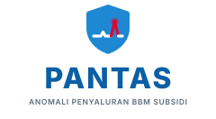

  

<strong>Penyaluran yang pantas, tercatat, terawasi.</strong>

---

# PANTAS

**P**emantauan **AN**omali **T**ransaksi & **A**liran **S**ubsidi — sistem pemantauan penyaluran BBM subsidi yang menandai transaksi menyimpang sebelum penyimpangan menjadi kerugian.

## Ruang Lingkup

PANTAS membaca data pembongkaran dan penyaluran BBM subsidi, lalu menilai setiap transaksi terhadap pola wajar dan ambang yang ditetapkan.

Jenis anomali yang dipantau:

| Kategori | Contoh temuan |
|---|---|
| Selisih volume | Volume surat jalan tidak sama dengan volume terukur di tangki pendam |
| Kuota | Konsumsi harian/bulanan SPBU melampaui alokasi |
| Pola transaksi | Pengisian berulang oleh kendaraan yang sama dalam rentang waktu singkat |
| Waktu | Pembongkaran atau penyaluran di luar jam operasional wajar |
| Kelengkapan data | Pembongkaran tanpa dokumen pendukung atau data terukur |

Setiap temuan diberi salah satu status: **Normal**, **Perlu Ditinjau**, **Anomali**, atau **Data Tidak Lengkap**.

## Identitas Visual

Identitas merek, logo, palet warna, dan design token ada di direktori [`brand/`](brand/).

- [`brand/BRAND-GUIDELINE.md`](brand/BRAND-GUIDELINE.md) — panduan lengkap merek
- [`brand/tokens.css`](brand/tokens.css) — variabel CSS siap pakai di aplikasi
- [`brand/preview.html`](brand/preview.html) — pratinjau visual (buka di peramban)
- [`brand/logo/`](brand/logo/) — seluruh varian logo dalam format SVG

## Status

Tahap awal. Baru identitas merek dan aset visual yang tersedia; implementasi aplikasi belum dimulai.

## Catatan

PANTAS adalah nama produk yang berdiri sendiri. Palet warnanya diselaraskan dengan bahasa warna korporat Pertamina agar serasi bila dipakai berdampingan, namun repositori ini tidak memuat logo maupun aset merek resmi Pertamina. Ketentuan penggunaan bersama dijelaskan pada bagian 6 panduan merek.
